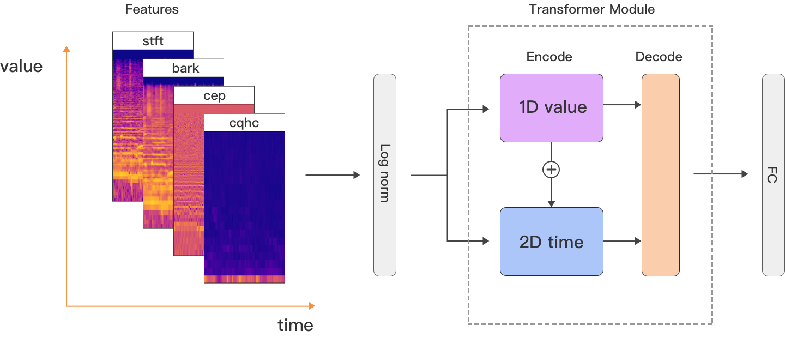
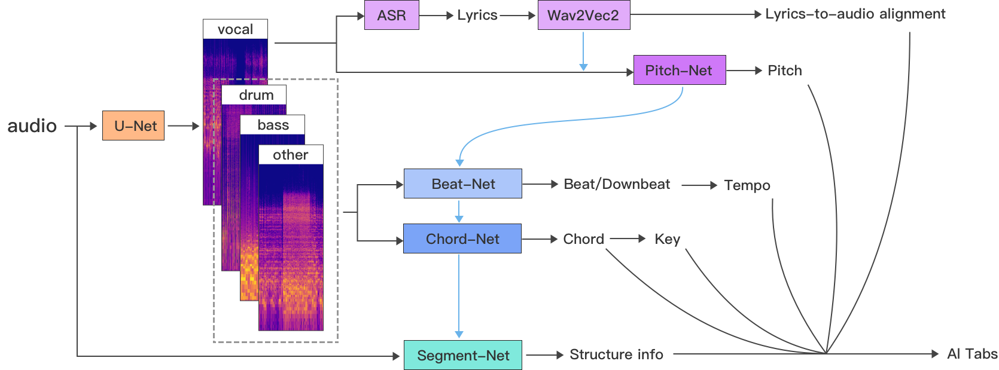
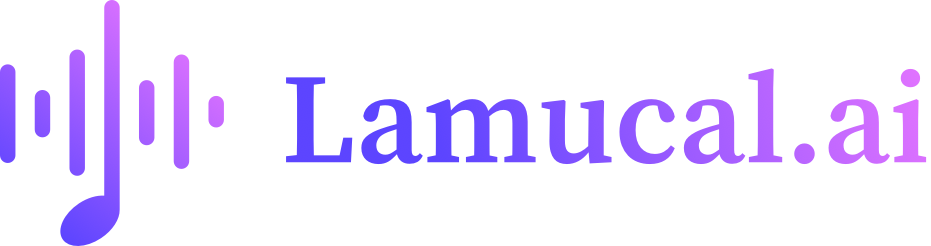

# U-Net

A transformer-based hybrid multimodal model, various transformer models address different problems in the field of music information retrieval, these models generate corresponding information dependencies that mutually influence each other.

An AI-powered multimodal project focused on music. Get chords, beats, lyrics, melody, and tabs for any song.

> The online experience, [See the site here](https://lamucal.ai)  

 

   

`U-Net` network model for audio source separation, `Pitch-Net`, `Beat-Net`, `Chord-Net` and `Segment-Net` based on the transformer model. Apart from establishing the correlation between the frequency and time, the most important aspect is to establish the mutual influence between different networks.   

The entire AI-powered process is implemented in `aitabs.py`, while the various network structure models can be referenced in the `models` folder.   
> **Note**: `U-Net` and `Segment-Net` use the stft spectrum of audio as input. `Beat-Net` uses three spectrograms of drums, bass, and other instruments as input,`Chord-Net` uses one spectrogram of the background music.

## Features
- **Chord**, music chord detection, including major, minor, 7, maj7, min7, 6, m6, sus2, sus4, 5, and inverted chords. Determining the **key** of a song.       

- **Beat**, music beat, downbeat detection and **tempo** (BPM) tracking   

- **Pitch**, tracking the pitch of the melody in the vocal track.  

- **Music Structure**, music segment boundaries and labels, include intro, verse, chorus, bridge and etc.    

- **Lyrics**, music lyrics recognition and automatic lyrics to audio alignment, use ASR (whisper) to recognize the lyrics of the vocal track. The alignment of lyrics and audio is achieved through fine-tuning the wav2vec2 pre-training model. Currently, it supports dozens of languages, including English, Spanish, Portuguese, Russian, Japanese, Korean, Arabic, Chinese, and more.   

- **AI Tabs**, Generate playable sheet music, including chord charts and six-line staves, using chords, beats, music structure information, lyrics, rhythm, etc. It supports editing functionalities for chords, rhythm, and lyrics.   

- **Other**, audio source separation, speed adjustment, pitch shifting, etc.      

For more AI-powered feature experiences, see the [website](https://lamucal.ai): 

  

